# DashNoteSystem UML Diagrams

Source: [`src/docs/lld.md`](../../src/docs/lld.md)

---

## 1. Protected HTTP request

Sequence for any JWT-protected route (notes, files, AI chat, etc.).

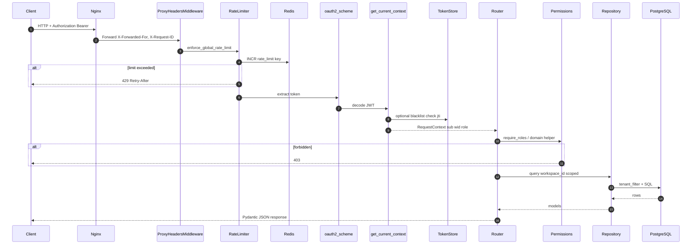

---

## 2. Application layers

Component view of the backend layering (§6).

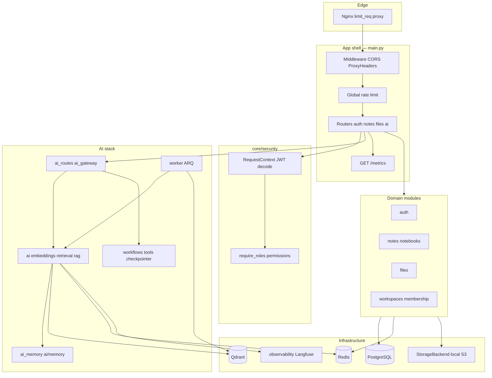

---

## 3. Embedding pipeline (Slice 1)

Note content → chunks → cached embeddings.

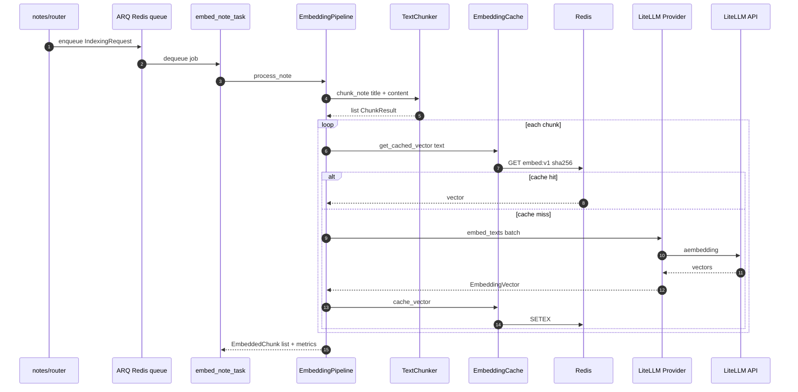

---

## 4. ARQ worker indexing

Full worker path including Qdrant upsert (Slice 1 + 2).

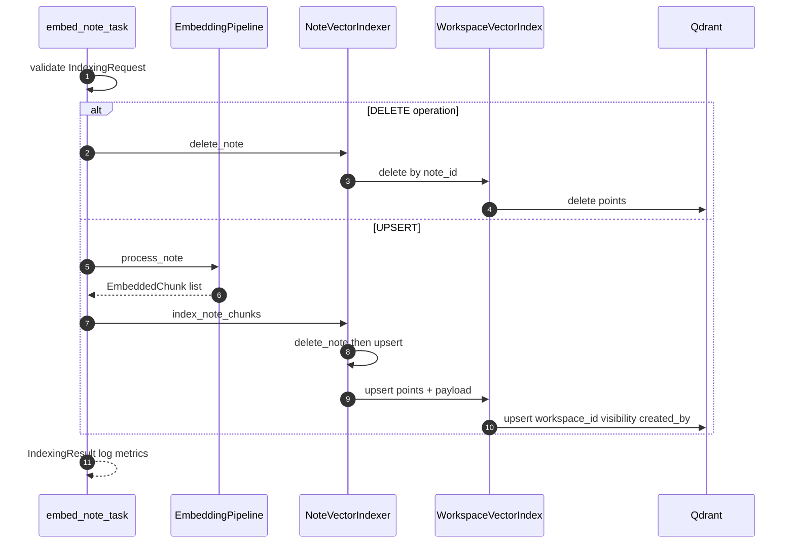

---

## 5. Semantic search + RBAC

`GET /ai/test-search` and internal retrieval used by RAG.

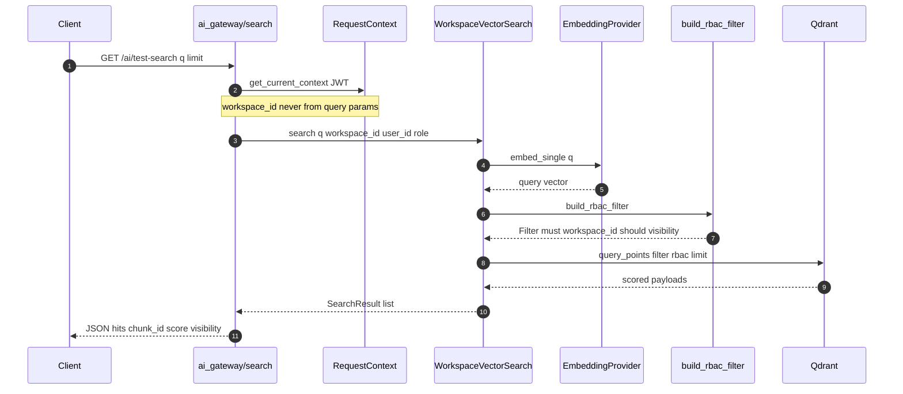

---

## 6. RAG chat (JSON)

`POST /ai/chat` with optional thread memory.

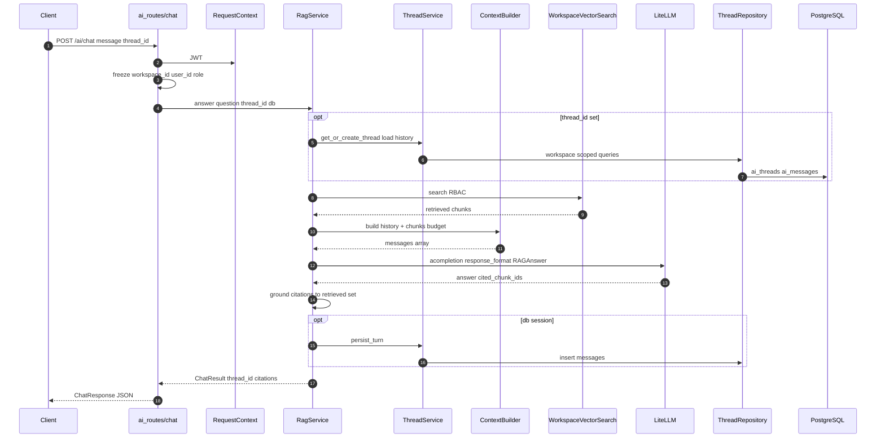

---

## 7. RAG streaming (SSE)

`POST /ai/chat/stream` — same logic, progressive tokens.

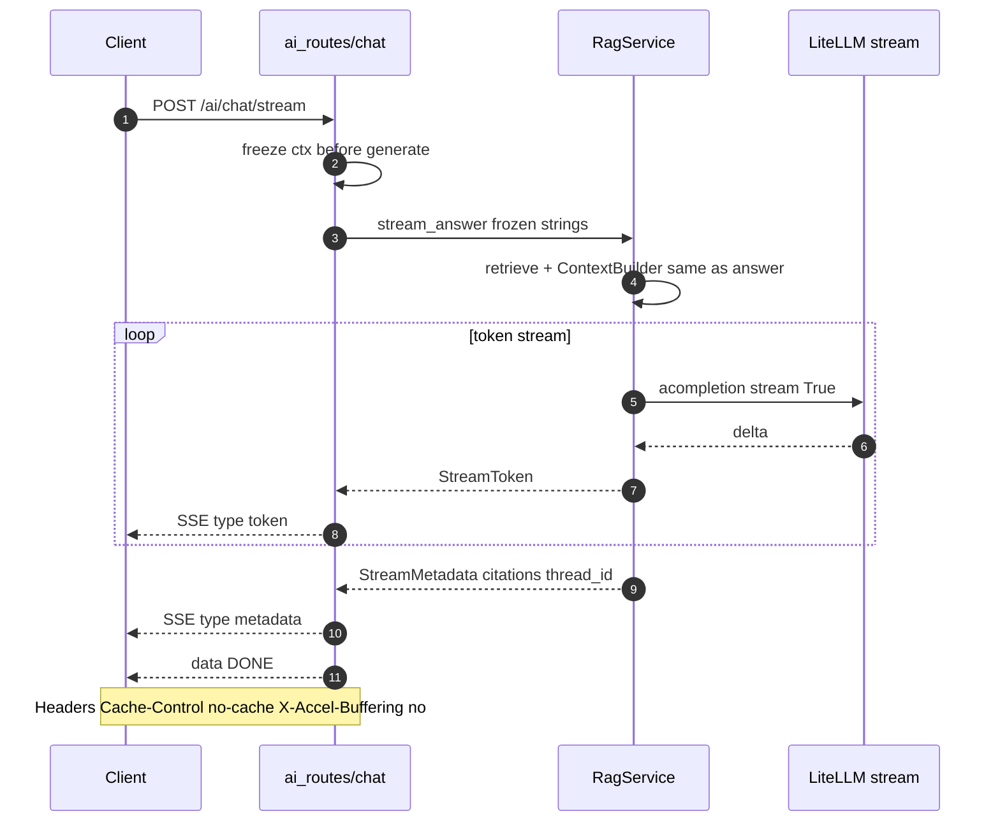

---

## 8. Conversation memory layers

Class collaboration — product layer vs agent execution layer.

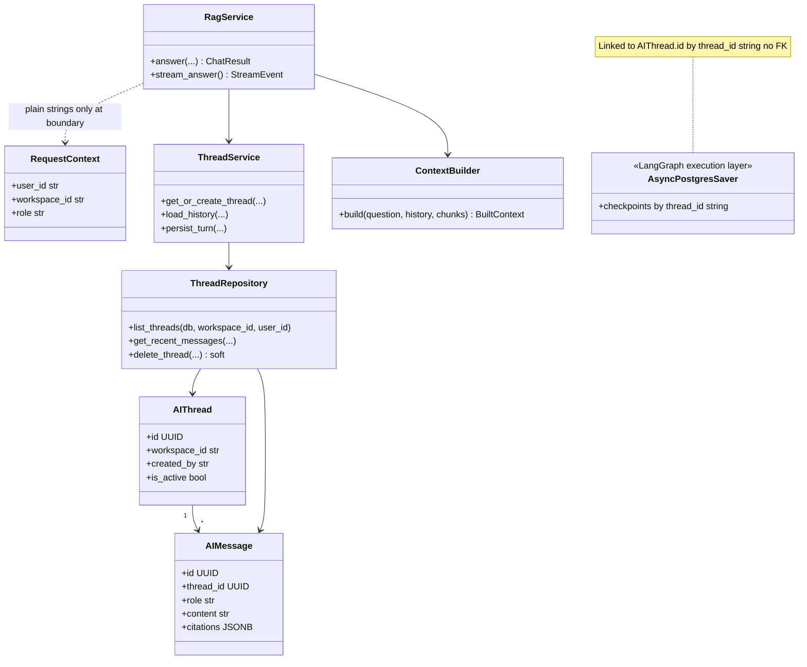

---

## 9. LangGraph agent loop

State machine + invoke sequence for `POST /ai/agent`.

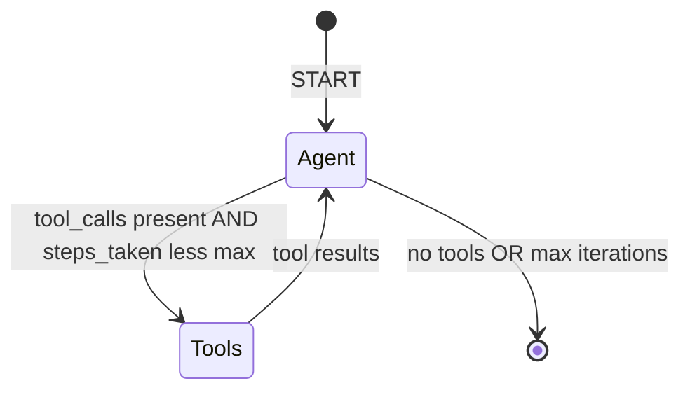

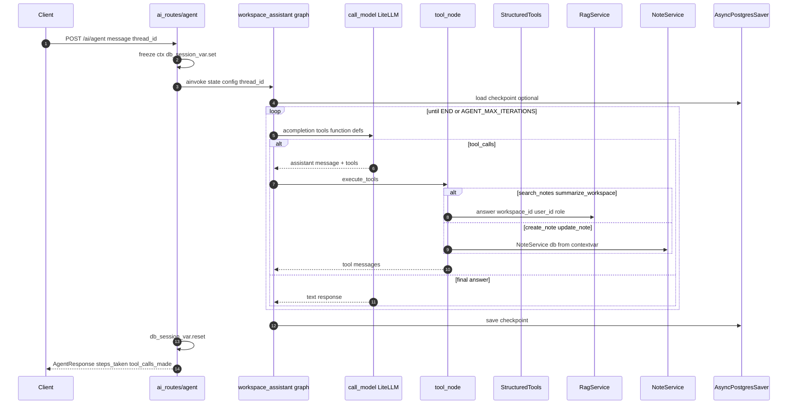

---

## 10. Docker Compose deployment

Runtime deployment view (see also `src/docs/system.md`).

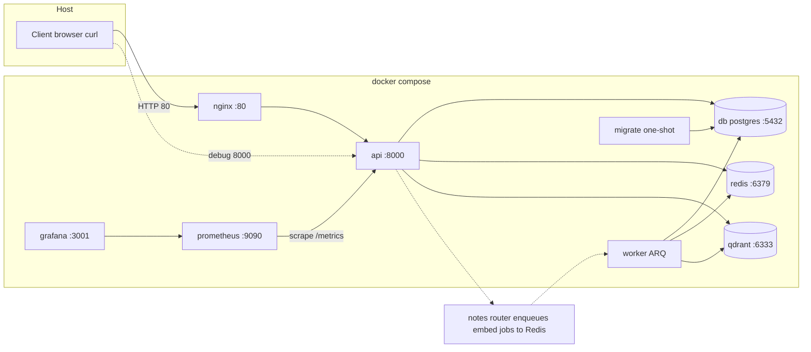
